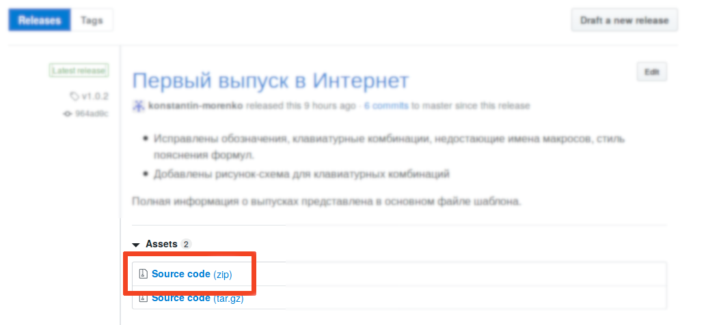

# Назначение

Эта система автоматической верстки была создана для того, чтобы
упростить верстку годового и квартальных научных отчетов.

Основные преимущества:
- нумерацию легко обновить после вставки таблиц/рисунков/формул или глав в
  середину документа
- отчет легко собирать из частей с сохранением нумерации, если все
  части используют один шаблон
- система автоматически подсчитывает количество рисунков, таблиц,
  формул, библиографических ссылок и приложений

Более подробные сведения о работе с отчетом приведены прямо в файле
отчета *Шаблон-732-2017-макросы*.

Проект использует семантическое версионирование.

Полное описание возможностей шаблона и работы с ним приведено прямо в
основном файле.

# Обратная связь

Предложения, пожелания и сообщения об ошибках можно отправлять в
[форме обратной связи](https://forms.yandex.ru/u/5d03bf6219621d0da3869577/)

Автор проекта: [Константин Моренко](konstantin-morenko.ru)

# Файлы

Разработа производится на
[github.com](https://github.com/konstantin-morenko/report-732-2017)

Чтобы скачать файл, перейдите по ссылке [Самый последний официальный
выпуск](https://github.com/konstantin-morenko/report-732-2017/releases/latest)
и нажмите на *Source code (zip)*

[Все выпуски и все версии](https://github.com/konstantin-morenko/report-732-2017/releases)
